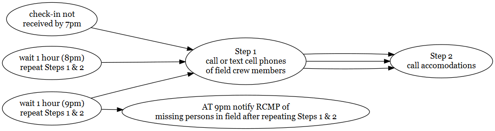

{.logo}

<br>

::: from
Al Irvine\
New Graph Environment\
[al\@newgraphenvironment](mailto:al@newgraphenvironment){.email}\
250-777-1518\
Date: `r format(Sys.Date(), "%Y-%m-%d")`
:::

<!-- Ministry of Environment  -->

<!-- Skeena Region   -->

<!-- 3726 Alfred Ave 1st Floor   -->

<!-- Smithers, BC V0J 2N0   -->

```{r setup, include = TRUE, echo =FALSE, message=FALSE, warning=FALSE}
# gitbook_on <- TRUE
gitbook_on <- FALSE  ##we just need turn  this on and off to switch between gitbook and pdf via paged.js


knitr::opts_chunk$set(echo=FALSE, message=FALSE, warning=FALSE, dpi=60, out.width = "100%")
options(scipen=999)
options(knitr.kable.NA = '--') #'--'
options(knitr.kable.NAN = '--')

source('R/packages.R')
source('R/functions.R')
# source('R/private_info.R')

name_project_number <- '2022-049'
# name_project_number2 <- '2021-040'
name_project_name <- 'sern-skeena-fish-passage'
name_repo <- 'safety_plan_skeena_2022'
name_pdf <- 'safety_plan'
name_project_complete <- paste0(name_project_number, '-', name_project_name)

link_repo <- paste0('https://newgraphenvironment.github.io/', name_repo, '/')
link_kml <- paste0('https://github.com/NewGraphEnvironment/', name_repo, '/raw/main/mapping/sites_', name_project_name, '_', format(Sys.Date(), '%Y%m%d'), '_kml_gpx.zip')
link_pdf <- paste0('https://github.com/NewGraphEnvironment/', name_repo, '/raw/main/docs/', name_pdf, '_', name_project_name, '.pdf')
link_fieldmaps <- 'https://hillcrestgeo.ca/outgoing/fishpassage/projects/bulkley/'
link_fieldmaps2 <- 'https://hillcrestgeo.ca/outgoing/fishpassage/projects/kisp/'
link_fieldmaps3 <- 'https://hillcrestgeo.ca/outgoing/fishpassage/projects/zymo/'


##this is reduntant but allows us to keep the gitbook seting for if we move to a better TOC
font_set <- 9


hotel1 <- 'Silverthorne RV park is located between Finning and the Sullivan Chevy dealership on the west side of town. The address is 1700 highway 16 but you could also type in Alix place which should bring you to the driveway as well. Contact Lance - 1 604 556 9903 - email: 399hflfibdi8v4u8b70ax17dv3oy@reply.airbnb.com'
hotel2 <- '595 Poplar Park Rd, Kitimat-Stikine B, BC V0J 1Y0 - Carol 250-842-8794'
hotel3 <- 'QRHW JX6 Smithers, British Columbia - 54.779045, -127.152596'
hotel4 <- '4685-4637 13 Ave, New Hazelton, BC V0J 2J0 - Carol 250-842-8794'
hotel5 <- '7523 Lake Kathlyn Rd, Smithers, BC V0J 2N2 - 54.830952, -127.212028'


vehicle1 <- '2013 Toyota Tundra black w/flatdeck and yellow can-am quad'
vehicle2 <- '2007 Toyota Tacoma - gold with canopy'
vehicle3 <- 'Nico Ridge - Witset - 2021 chev Silverado. 4x4 truck'
```

<br>

# `r paste0('Safety Plan - ',name_project_complete)` {.unnumbered .break-after-me}

The latest version of this pdf can be downloaded [here](https://github.com/NewGraphEnvironment/safety_plan_skeena_2022/raw/main/docs/safety_plan_sern-skeena-fish-passage.pdf).

<br>

A zip file which includes kml (google earth) and gpx (garmin) files of the sites to be potentially assessed can be downloaded [here](https://github.com/NewGraphEnvironment/safety_plan_skeena_2022/raw/main/mapping/sites_sern-skeena-fish-passage_20220824_kml_gpx.zip). Georeferenced pdf maps can be accessed and downloaded [here for Bulkley and Morice](https://hillcrestgeo.ca/outgoing/fishpassage/projects/bulkley/), [here for Kispiox](https://hillcrestgeo.ca/outgoing/fishpassage/projects/kisp/) and [here for the Copper](https://hillcrestgeo.ca/outgoing/fishpassage/projects/zymo/).


<br>

A summary of sites to be potentially assessed is included as Table \@ref(tab:tab-sites).  The process to shortlist these sites is documented [here](https://newgraphenvironment.github.io/fish_passage_skeena_2022_planning/) with a password provided in the email when this plan was originally forwarded.  If you require the password again please email al@newgraphenvironment.com.

**Accomodations**

Al - `r vehicle1`:

-   `r hotel1`
-   `r hotel2`
-   `r hotel3`

Mateo - `r vehicle2`:

-   `r hotel1`
-   `r hotel4`
-   `r hotel5`

```{r info-hospitals}
hospital_name <- 'Houston Health Centre'
hospital_phone <- '250-845-2294'
hospital_address <- '3202 14 St, Houston, BC V0J 1Z0'

hospital_name2 <- '(Smithers) Bulkley Valley District Hospital'
hospital_phone2 <- '250-847-2611'
hospital_address2 <- '3950 8 Ave, Smithers, BC V0J 2N0'

hospital_name3 <- 'Wrinch Memorial Hospital - Hazelton'
hospital_phone3 <- '250-842-5211'
hospital_address3 <- '2510 Hwy 62, Hazelton, BC V0J 1Y0'

```

```{r settings-gitbook, eval= gitbook_on}
photo_width <- "100%"
font_set <- 11

```

```{r settings-paged-html, eval= identical(gitbook_on, FALSE)}
photo_width <- "80%"
font_set <- 9
```

```{r import-projects}
##Read in the contacts spreadsheet
####--------------bring in the equipment list and crew info-----------------
projects <-  readxl::excel_sheets(path = "../onboarding/data/template_contacts_safetylog.xlsx") %>%
  purrr::set_names() %>%
  purrr::map(read_excel,
             path = "../onboarding/data/template_contacts_safetylog.xlsx",
             .name_repair = janitor::make_clean_names) %>%
  purrr::set_names(janitor::make_clean_names(names(.))) %>%
  purrr::map(at_trim_xlsheet) %>% #this is the clean run of this function
  purrr::map(plyr::colwise(type.convert))

```

```{r  tab-overview, eval= F}
# turned eval = off!!!!
tab_overview <- projects %>% 
  pluck('projects') %>% 
  filter(project_number == name_project_number) %>% 
  select(project_number, project_name)

tab_overview %>% 
  kable() %>% 
  kableExtra::kable_styling(c("condensed", "responsive"),
                              full_width = T,
                              font_size = font_set)
```

<br>

```{r tab-crew}
crew_ids <- c('airvine', 
              'mwinterscheidt', 
              'tpierre', 
              'vjoseph', 
              'jolson', 
              'agreen',
              'dnical')


tab_crew <- projects %>% 
  pluck('crew_contacts')  %>% 
  filter(id %in% crew_ids) %>% 
  select(-id) %>% 
  purrr::set_names(nm = names(.) %>% stringr::str_replace_all('crew_', ''))


tab_crew %>% 
  kable(caption = 'Crew members details and emergency contacts') %>% 
  kableExtra::kable_styling(c("condensed", "responsive"),
                              full_width = T,
                              font_size = font_set)
```

# Equipment Checklists {.unnumbered}

```{r table-equipment}

#https://stackoverflow.com/questions/63643051/r-dplyr-filter-string-condition-on-multiple-columns

##equipment personal 
tab_eq_pers <- projects %>% 
  pluck('equipment') %>% 
  filter(!is.na(eq_pers_standard)) %>% 
  arrange(eq_safety) %>% ##have these first on the list
  select(eq_item)  %>% 
  make_untidy_table() %>% 
  rename(`Personal Equipment Checklist` = eq_item)

my_caption = 'Personal Equipment Checklist'

# tab_eq_pers %>% 
#     kable(caption = my_caption, booktabs = T) %>%
#   kableExtra::kable_styling(c("condensed"),
#                             full_width = T,
#                             font_size = font_set)
tab_eq_pers %>% 
  kable() %>% 
  kableExtra::kable_styling(c("condensed", "responsive"),
                              full_width = T,
                              font_size = font_set)
  


```

<br>

```{r equip_crew}
##equipment for the crew
tab_eq_crew <- projects %>% 
  pluck('equipment') %>% 
  # mutate(across(everything(), as.character)) %>% 
  filter(if_any(starts_with('eq_task'), ~ . == 'fish passage')) %>% 
  filter(is.na(eq_pers_standard)) %>% 
  arrange(eq_safety) %>% 
  select(eq_item)  %>% 
  make_untidy_table() %>% 
  rename(`Crew Equipment Checklist` = eq_item)

my_caption = 'Crew Equipment Checklist'

tab_eq_crew %>% 
  kable() %>% 
  kableExtra::kable_styling(c("condensed", "responsive"),
                              full_width = T,
                              font_size = font_set)

```

<br>

### Nearest Hospitals {.unnumbered}

```{r hospital-1, fig.cap=my_caption, fig.width=6}
my_caption = paste(hospital_name, hospital_address, hospital_phone, sep = ' - ')

##register google key defined in 'R/private_info.R' file
ggmap::register_google(key = Sys.getenv('GOOG_API_KEY'))

#define the area of the base map by using a bounding box 
mybasemap <- ggmap::get_map(location = hospital_address,
                     source = "google",
                     zoom = 15,
                    maptype = "roadmap")  

ggmap::ggmap(mybasemap)
  # geom_point(data = geocode(hospital_address), 
  #            aes(x = lon, y = lat, colour = "black", stroke = 10), #https://stackoverflow.com/questions/54803891/custom-shape-in-ggplot-geom-point
  #            show.legend = F)

knitr::asis_output(paste(hospital_name, hospital_address, hospital_phone, sep = ' - '))   
```

<br>

```{r hospital2, fig.cap='my_caption', fig.width=6, eval = T}

#define the area of the base map by using a bounding box 
mybasemap <- ggmap::get_map(location = hospital_address2,
                     source = "google",
                     zoom = 16,
                    maptype = "roadmap")  

ggmap::ggmap(mybasemap)
  # geom_point(data = geocode(hospital_address), 
  #            aes(x = lon, y = lat, colour = "black", stroke = 10), #https://stackoverflow.com/questions/54803891/custom-shape-in-ggplot-geom-point
  #            show.legend = F)

knitr::asis_output(paste(hospital_name2, hospital_address2, hospital_phone2, sep = ' - ')) 
```

<br>

```{r hospital3, fig.cap='my_caption', fig.width=6, eval = T}

#define the area of the base map by using a bounding box 
mybasemap <- ggmap::get_map(location = hospital_address2,
                     source = "google",
                     zoom = 16,
                    maptype = "roadmap")  


ggmap::ggmap(mybasemap)
  # geom_point(data = geocode(hospital_address), 
  #            aes(x = lon, y = lat, colour = "black", stroke = 10), #https://stackoverflow.com/questions/54803891/custom-shape-in-ggplot-geom-point
  #            show.legend = F)

knitr::asis_output(paste(hospital_name3, hospital_address3, hospital_phone3, sep = ' - ')) 
```

## Field Plan {.unnumbered}

Field work methods will result in products feeding reporting formats such as [here](https://newgraphenvironment.github.io/fish_passage_bulkley_2020_reporting/) for 2020 and [here](https://newgraphenvironment.github.io/fish_passage_skeena_2021_reporting/) for 2021. Still picking away at 2021 and just updating version IDs as I get through it. and will generally follow procedures in:

-   [fish passage assessments](https://www2.gov.bc.ca/assets/gov/environment/natural-resource-stewardship/land-based-investment/forests-for-tomorrow/field-assessment-for-determining-fish-passage-status-of-cbs.pdf) [@fish_passage_assessments]

-   [habitat confirmations](https://www2.gov.bc.ca/assets/gov/environment/natural-resource-stewardship/land-based-investment/forests-for-tomorrow/checklist-for-fish-habitat-confirmation-201112.pdf) [@confirmation_checklist_2011].

<br>

Presence/absence of fish, species composition/density and distribution limits can be useful for prioritizing which crossings are a best fit for fish passage restoration and help inform follow up monitoring so electrofishing and minnowtrapping may be conducted. Standard Fish and Fish Habitat Inventory Standard Field Form [site cards](https://www2.gov.bc.ca/gov/content/environment/natural-resource-stewardship/laws-policies-standards-guidance/inventory-standards/aquatic-ecosystems) are used to gather habitat data. Field guide is [here](https://www2.gov.bc.ca/assets/gov/environment/natural-resource-stewardship/nr-laws-policy/risc/sitecard20.pdf)

<br>

We have PIT tagging equipment so we could consider [tagging](https://www.youtube.com/watch?v=9CKZ9yaS5o8) fish captured at electrofishing sites to help us better understand population sizes and fish movement upstream and downstream of sites over the years.

<br>

We are running digital field form tests using a product called [Mergin Maps](https://merginmaps.com/?gclid=Cj0KCQjwxb2XBhDBARIsAOjDZ34oq-iMid3vRrgK1ZAkJ_yiz4aWY-LLF90PHiXzELbZIrxooV9vWKYaAgl2EALw_wcB) which syncs with QGIS. Crews can access projects with a free account. Please send me your usernames and I can begin to share projects/forms.

<br>

A guide to freshwater fish id such as @mcphail_carveth1993FieldKey can be useful and can be downloaded [here](https://a100.gov.bc.ca/pub/acat/documents/r13659/486FieldKeytoFreshwaterFishes1993Part1of2_1210014849226_8e248a8d30d97e6c45ef54a340babd2ffb57b14a3b16.pdf).


<!-- and an overview map of displaying potential sample locations is included as Figure 1. -->

<br>

### Check In Procedures {-}

Call, text or inreach Tara Stark (2505059854) each morning to share the plan for the day (i.e. name of roads and sites). Check in time is before 7 pm each evening although we regularly check in throughout the day (ex. at arrival to site, 1pm and 4pm) on the inreach or by text and report position/provide updates.

<br>

#### Procedures for Failed Check-In - for Check in person {-}

<br>

Procedures are summarized in the following Figure. If phone call or inReach check-in is not received by 7pm send text to inreach units, call or text cell phones of field crew members. If no response please call accommodations then personal emergency contacts to see if they have heard anything. Wait 1 hour and text inreach, text or call cell phones and personal emergency contacts and accomodations again. Repeat after 2 hours (9 pm) - if no response then notify the RCMP of a missing persons in field.

<br>

```{r flow-check-in-fail, fig.cap= 'Procedures for failed check-in', eval=T}
#  Not sure why this doesn't work yet
DiagrammeR::grViz("digraph rmarkdown{
  
graph[layout = dot, rankdir = LR]

d1 [label = 'check-in not \n received by 7pm']
d2 [label = 'Step 1 \n call or text cell phones \n of field crew members']
d3 [label = 'Step 2 \n call accomodations']
d4 [label = 'wait 1 hour (8pm) \n repeat Steps 1 & 2']
d5 [label = 'wait 1 hour (9pm) \n repeat Steps 1 & 2']
d6 [label = 'AT 9pm notify RCMP of \n missing persons in field after repeating Steps 1 & 2']


d1 -> d2 -> d3 
d4 -> d2 -> d3 
d5 -> d2 -> d3 
d5 -> d6
}") %>% 
  DiagrammeRsvg::export_svg() %>% 
  charToRaw %>%
  rsvg::rsvg_png("fig/flow-check-in-fail.png")
  
  


```

```{r load, results='hide'}
# grab the geopackage from the mergin project 
# which project?
mergin_name <- 'bcfishpass_skeena_20220823'

table_sites <- sf::st_read(
  paste0('../../gis/mergin/',
         mergin_name,
         '/sample_site_options.gpkg')
  )

```

```{r gpx, results='hide'}

dir.create('mapping')

##remove the old gpx
files_to_delete <- paste0("mapping/", list.files(path = "mapping/", pattern = "\\.gpx$"))
file.remove(files_to_delete)

#make a gpx file 
table_sites %>% 
  mutate(name = id,
         desc = paste0(source, ' ', followup_priority, ' ', st_rearing_km, 'km st rearing ', st_spawning_km, 'km st spawning ', followup_comments)) %>% 
  # filter(source == 'morice' | source == 'cwf') %>% ##of just Morice and CWF
  select(name, desc,  geom) %>% 
  write_sf(dsn = paste0("mapping/sites_", name_project_name, '_', format(Sys.Date(), "%Y%m%d"), ".gpx"), driver="GPX",
           dataset_options="GPX_USE_EXTENSIONS=yes", delete_dsn = TRUE)


```

```{r kml, results='hide', eval = T}

##remove the old kml
files_to_delete <- paste0("mapping/", list.files(path = "mapping/", pattern = "\\.kml$"))
file.remove(files_to_delete)


##make a kml for adding the georef pdf and sharing with stakeholders

df <- table_sites %>%
  mutate(name = id) %>% 
  mutate(shape = 'http://maps.google.com/mapfiles/kml/paddle/red-blank.png',
         color = NA_character_,
         label = NA_character_) %>% 
  dplyr::group_split(id)  %>% 
  purrr::map(fpr::fpr_make_html_tbl) %>%
  dplyr::bind_rows()


sites_kml <- as(df, 'Spatial')

# shape = "http://maps.google.com/mapfiles/kml/pal2/icon18.png"


kml_open(paste0("mapping/sites_", name_project_name, '_', format(Sys.Date(), "%Y%m%d"), '.kml'))
kml_layer(sites_kml, colour = '#ff7f00', shape = sites_kml$shape, labels = sites_kml$name, 
          html.table = sites_kml$html_tbl,
          z.scale = 2, LabelScale = 1, size = 1.5)  ##I don't see the label
kml_close(paste0("mapping/sites_", name_project_name, '_', format(Sys.Date(), "%Y%m%d"), '.kml'))


```

```{r zip-together, results='hide'}
##now we will zip up the kml files in the data folder and rename with kmz
##remove the old zip
files_to_delete <- paste0("docs/", list.files(path = "docs/", pattern = "\\.zip$"))
file.remove(files_to_delete)


files_to_zip <- paste0("mapping/", list.files(path = "mapping/", pattern = "\\.kml$|.gpx$"))  ##this will zip all kmls in file so watch out
zip::zipr(paste0("mapping/sites_", name_project_name, '_', format(Sys.Date(), "%Y%m%d"), '_kml_gpx.zip'), files = files_to_zip)  ##it does not work to zip to kmz!!
```

<!-- `r if(gitbook_on){knitr::asis_output("<br>")} else knitr::asis_output("<br><br><br><br><br><br><br>")` -->

```{r map-prep, eval=F}
##register google key defined in 'R/private_info.R' file
ggmap::register_google(key = Sys.getenv('GOOG_API_KEY'))

#define the area of the base map by using a bounding box 
mybasemap <- ggmap::get_map(location = c(left = table_sites %>% pull(long) %>% min()-0.01, 
                                    bottom = table_sites %>% pull(lat) %>% min()-0.01,
                                    right = table_sites %>% pull(long) %>% max()+0.01,
                                    top = table_sites %>% pull(lat) %>% max()+0.01),
                     source = "google",
                     zoom = 8,
                    maptype = "hybrid")


#define the area of the base map by using the middle. 
# mybasemap <- ggmap::get_map(location = c(lon = table_sites %>% pull(long) %>% mean(),
#                                          lat = table_sites %>% pull(lat) %>% mean())
#                             source = "google",
#                             zoom = "auto",
#                             maptype = "hybrid")


mymap <- ggmap::ggmap(mybasemap) + 
  geom_point(data = table_sites, 
             aes(x = long, y = lat, colour = color),
             show.legend = F)
  # ggsflabel::geom_sf_label(data = table_sites, 
  #                          aes(x = long, y = lat, label = name),
  #                          force = 100, 
  #                          nudge_x = -2)

mymap

# Figure 1. Map of potential sampling areas. High priority sites in red and moderate priority in green.
```

`r if(gitbook_on){knitr::asis_output("<br>")} else knitr::asis_output("<br><br><br><br><br><br><br><br><br><br><br><br><br><br><br><br>")`

```{r tab-sites}
table_sites %>% 
  sf::st_drop_geometry() %>% 
  arrange(id) %>% 
  select(id, 
         Stream = stream_name, 
         # watershed_code_50k, 
         # watershed_code_20k, 
         long, 
         lat, 
         comments = followup_comments,
         ) %>% 
  kable(caption = 'Potential sample locations.', booktabs = T) %>%
  kableExtra::kable_styling(c("condensed"),
                            full_width = T,
                            font_size = font_set)
  # kableExtra::column_spec(column = c(7), width_max = '1.5in') %>% 
  # # kableExtra::column_spec(column = c(3,4,7), width_min = '1.0in') %>% 
  # kableExtra::column_spec(column = c(8), width_max = '2.0in')
```

# References {.unnumbered}
